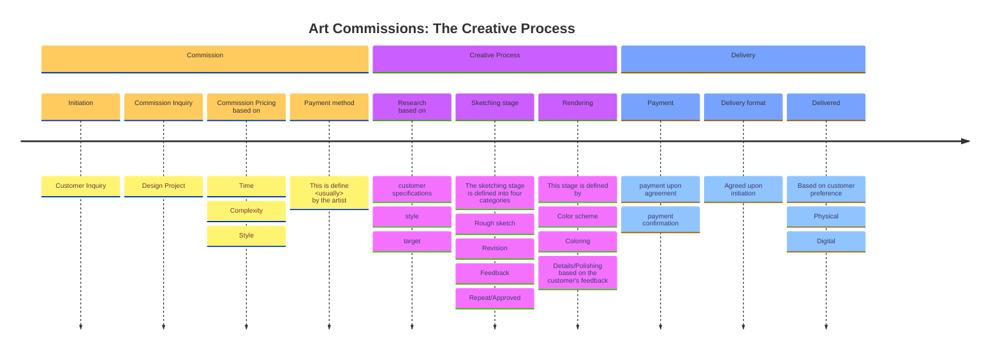

# Timelime Diagram 
**Based on my commission process.**

My timeline is variate from client to client based on the scope of the project.
But overall this is how must of the proccess is break in the course of the time agreed.

## Timeline Breakdown 

**_the timeline is break into three sections:_**

*Commission
*Creative Process
*Delivery

1. Commission:

    Here, I interact with the client, asking and answering questions regarding the project to see if I can fulfill the client's request. 

    Here, I also delve into the specifics of the services I offer and those I don't  , as well as the payment methods available, in addition to the revision and drawing process.

2. Creative Process:

    Here is where I will spend most of the time. I create mood boards with reference images from the client and from me.
    After being satisfied with the mood board and the thumbnails, I show them to the client and then move to the sketching process.

    The sketching process is based on the thumbnails the client approved. Based on the client's feedback, I create several thumbnail compositions to discuss with the client before moving to the final sketch.

    Once the final sketch is approved, we move to the next stage, where I refine the selected sketch and begin the color and rendering process. 
    I work with the client on a color scheme that translates the composition. After approval, I  move to coloring and rendering, reviewing the last revision with the client. Lastly, I will move to the final stage if the client agrees with the final product and no more retouching is needed. 

3. Delivery:
   
    In the last section, the client makes the final payment, and I deliver the final product.   
    The delivery process will depend on the client's preferred format at the beginning stage. 
    
