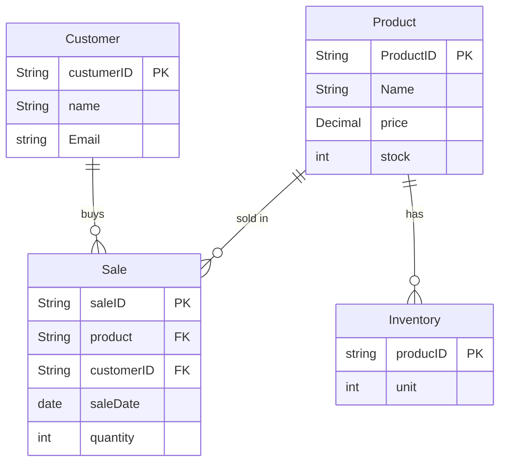

# NikeStore_ERD.md

# Store Diagraman

  **Product** | **Customer** | **Sale** | **Inventory**    
  ----------- | ------------ | -------- | ---------------
  shoes offered in store | personal information | products tagged under sales | quantity of availiabilty 

